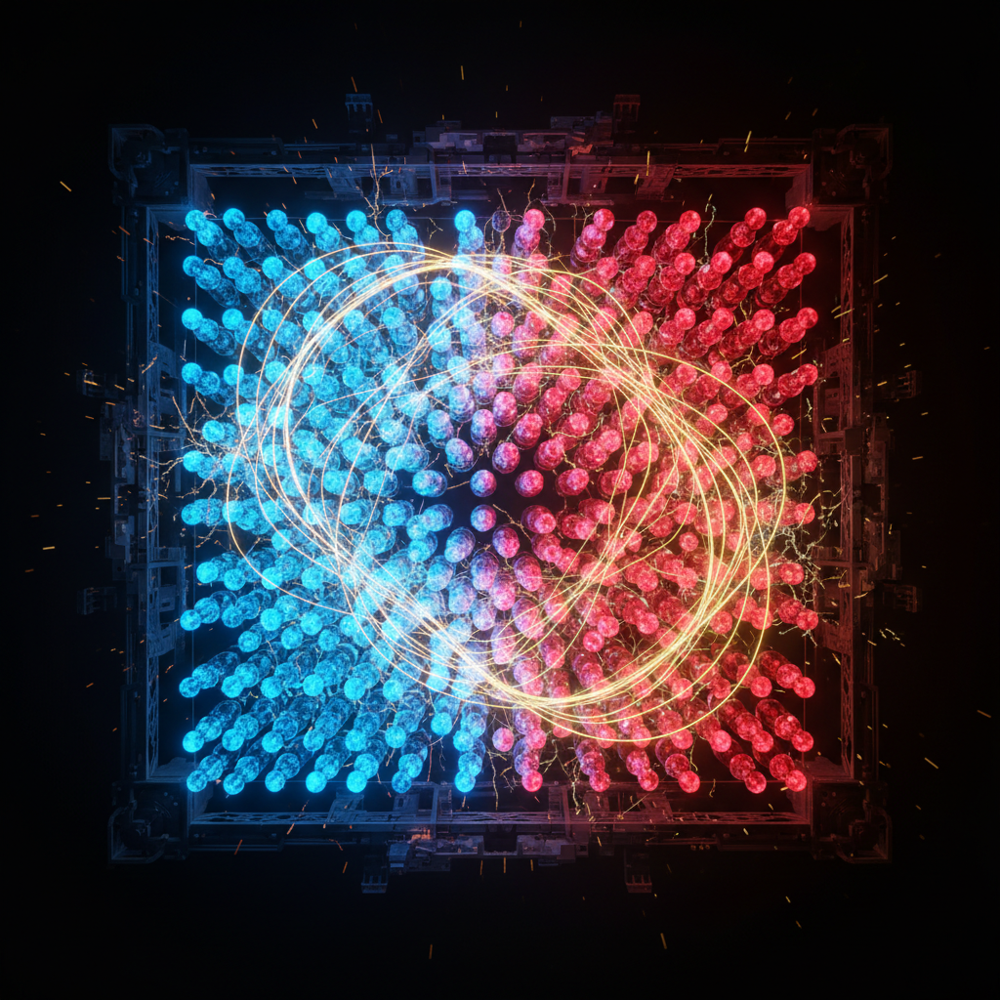

<div align="center">



# Daugherty Engine: Public Benchmarks

### Verifiable Performance Claims for Production-Scale Combinatorial Optimization

[](https://creativecommons.org/licenses/by/4.0/)
[](https://opensource.org/licenses/MIT)
[](https://www.python.org/downloads/)
[](data/benchmark_claims.json)
[](https://1millionspins.originneural.ai/)
[](https://originneural.ai)

> **Problems that take conventional solvers 14 months -- solved in under an hour.**
>
> Physics does the work. The GPU parallelizes it.
>
> Every claim is publicly verifiable.

</div>

---

## Table of Contents

- [What Is This?](#what-is-this)
- [Performance Claims](#performance-claims)
- [The Physics](#the-physics)
- [Quick Start](#quick-start)
- [Verification](#verification)
- [The Data](#the-data)
- [Problem Types](#problem-types)
- [Comparison](#comparison)
- [API Security](#api-security)
- [Blockchain Certification](#blockchain-certification)
- [FAQ](#faq)
- [Repository Structure](#repository-structure)
- [Publications](#publications)
- [Citation](#citation)
- [License](#license)
- [Contributing](#contributing)

---

## What Is This?

This repository contains the **publicly verifiable benchmark data, verification tools, and documentation** for the Daugherty Engine -- a high-performance combinatorial optimization solver based on the Simulated Bifurcation Machine (SBM).

The engine itself is proprietary. **This repository is not.**

Here you will find:
- All performance claims with verification methodology
- Standard problem generators for fair benchmarking
- Solution validators (standard math, no proprietary code)
- API security architecture documentation
- Verification and certification system design

**We publish the claims, the methodology, and the tools to test them.** The engine internals remain confidential.

---

## Performance Claims

All claims are publicly verifiable via the engine's REST API or the live demo.

| # | Problem | Scale | Claimed Result | Verification |
|---|---------|-------|---------------|-------------|
| 1 | **3-SAT** (alpha=4.27) | n=1,000 | **99.2% satisfaction** | API: `/verify/sat` |
| 2 | **Random Ising** | n=1,000 | State-of-the-art energy | API: `/solve/ising` |
| 3 | **Random Ising** | n=5,000 | SOTA at full connectivity | API: `/solve/ising` |
| 4 | **Max-Cut** | n=1,000 | Competitive with SOTA | API: `/solve/maxcut` |
| 5 | **Ising (1M spins)** | n=1,000,000 | **< 40 minutes** | [Live demo](https://1millionspins.originneural.ai/) |

The 3-SAT result at alpha=4.27 is at the **exact phase transition** -- the hardest regime for random 3-SAT, where instances transition sharply from satisfiable to unsatisfiable.

Full claim details with parameters and verification instructions: [`data/benchmark_claims.json`](data/benchmark_claims.json)

---

## The Physics

The Daugherty Engine simulates a network of coupled oscillators governed by Hamiltonian mechanics:

```
H(x, y) = -1/2 * sum_i y_i^2 + 1/2 * (1 - p(t)) * sum_i x_i^2 - c0/2 * sum_{ij} J_ij x_i x_j
```

As the control parameter `p(t)` ramps past the **bifurcation point**, oscillators spontaneously break symmetry and settle into +/-1 states that minimize the Ising energy:

```
E = -sum_{ij} J_ij * sigma_i * sigma_j - sum_i h_i * sigma_i
```

The algorithm is **Simulated Bifurcation** -- a classical method published by Goto et al. (2019, 2021). The Daugherty Engine adds proprietary parameter tuning, adaptive stabilization, and GPU optimization that are not disclosed publicly.

See [`docs/algorithm_overview.md`](docs/algorithm_overview.md) for the full published physics.

---

## Quick Start

```bash
# Clone
git clone https://github.com/OriginNeuralAI/Daugherty-Engine-Public.git
cd Daugherty-Engine-Public

# Install dependencies
pip install -r scripts/requirements.txt

# List all verifiable claims
python scripts/verify_claims.py --list

# Generate a benchmark problem
python scripts/generate_problems.py sat --n 100 --alpha 4.27

# Validate a solution
python scripts/validate_solution.py sat --problem problem.json --solution solution.json
```

**Load the claims in 3 lines:**

```python
import json
with open('data/benchmark_claims.json') as f:
    claims = json.load(f)

for claim in claims['claims']:
    print(f"{claim['id']}: {claim['claimed_result']['display']}")
```

---

## Verification

### Via API

The engine provides public verification endpoints that require no authentication:

```bash
# Verify SAT performance claim
curl -X POST http://localhost:5000/verify/sat \
  -H "Content-Type: application/json" \
  -d '{"num_vars": 100, "alpha": 4.27, "num_trials": 5}'

# List all verifiable claims
curl http://localhost:5000/claims
```

### Via Scripts

```bash
# Verify all claims against running API
python scripts/verify_claims.py --api-url http://localhost:5000 --all

# Verify specific claim
python scripts/verify_claims.py --claim SAT-001
```

### Without API Access

You can verify the **methodology** without engine access:

1. Generate standard benchmark instances with `scripts/generate_problems.py`
2. Solve them with your own solver (SA, GA, D-Wave, etc.)
3. Compare your results against our claimed performance
4. Use `scripts/validate_solution.py` to validate solution correctness

---

## The Data

### [`data/benchmark_claims.json`](data/benchmark_claims.json)

Complete set of 5 performance claims with:

| Field | Description |
|-------|-------------|
| `id` | Claim identifier (e.g., SAT-001) |
| `problem_type` | Problem class |
| `parameters` | Problem generation parameters (reproducible) |
| `claimed_result` | What is claimed (metric, value, display) |
| `verification` | How to independently verify |
| `status` | Current verification status |

Also includes D-Wave comparison data and hardware specifications.

### [`data/problem_types.json`](data/problem_types.json)

Reference for all 6 supported problem types:

| Problem | Reduction | Complexity |
|---------|-----------|------------|
| Ising Model | Native | NP-hard |
| QUBO | Direct mapping | NP-hard |
| 3-SAT | Clause-to-coupling | NP-complete |
| Max-Cut | Adjacency-to-Ising | NP-hard |
| TSP | Via QUBO | NP-hard |
| Graph Coloring | Via QUBO | NP-complete |

Includes standard reduction formulas and literature references.

See [`data/README.md`](data/README.md) for the complete data dictionary.

---

## Problem Types

The Daugherty Engine solves any problem reducible to Ising form. The key insight: **the Ising model is a universal substrate for NP-hard optimization** (Lucas, 2014).

```
    ISING MODEL (native)
         |
    +----+----+----+----+
    |    |    |    |    |
  QUBO  SAT  MaxCut TSP  Graph
         |              Coloring
    (via penalty   (via QUBO
     encoding)      encoding)
```

Generate standard benchmark instances for any type:

```bash
python scripts/generate_problems.py ising --n 1000 --seed 42
python scripts/generate_problems.py sat --n 1000 --alpha 4.27
python scripts/generate_problems.py maxcut --n 1000 --density 0.01
python scripts/generate_problems.py qubo --n 100
```

---

## Comparison

| System | Variables | Connectivity | Hardware |
|--------|-----------|-------------|----------|
| **D-Wave Advantage** | 5,627 qubits | Pegasus (sparse, ~15/qubit) | ~$15M cryogenic system |
| **Daugherty Engine** | **1,000,000 spins** | **Full (dense, N-1/spin)** | **$1.57/hr GPU** |

Key differences:
- **Full connectivity**: Every spin interacts with every other spin -- no embedding overhead
- **No cryogenics**: Runs on commodity NVIDIA GPUs at room temperature
- **178x scale**: 1M variables vs 5,627 qubits
- **Dense problems**: D-Wave's sparse Pegasus topology requires minor embedding for dense problems, reducing effective qubit count significantly

**Hardware used:** NVIDIA RTX A6000 (48GB VRAM) / RTX 5070 Ti (17.1GB GDDR7)

---

## API Security

The REST API implements security layers that enable verification while protecting trade secrets:

| Layer | Purpose |
|-------|---------|
| **Rate Limiting** | 100 requests/hour per client |
| **Input Validation** | Maximum problem sizes enforced |
| **Output Sanitization** | Quality tiers instead of raw energies |
| **Timing Obfuscation** | Coarse categories, ±10% noise |
| **Solution Hashing** | SHA-256 hash for verification without disclosure |
| **PQC Authentication** | SHA3-256 quantum-resistant auth for solve endpoints |

**Raw energy values, timing data, and iteration counts are never exposed.** The API returns quality scores (0-100) and tier classifications (EXCELLENT/GOOD/FAIR/POOR) instead.

See [`docs/api_security.md`](docs/api_security.md) for the complete architecture.

---

## Blockchain Certification

Every engine deployment is cryptographically fingerprinted and can be anchored to the BSV blockchain:

```
Source Code  -->  SHA-256 Fingerprint  -->  Certification Receipt  -->  BSV Transaction
(semantic hash)   (layered manifest)       (pass/fail, no secrets)     (immutable proof)
```

**What goes on-chain:** Engine version, master fingerprint hash, validation pass/fail, timestamp.

**What does NOT go on-chain:** Parameters, energy values, timing data, source code.

See [`docs/verification_system.md`](docs/verification_system.md) for the full system design.

---

## FAQ

<details>
<summary><b>Is the Daugherty Engine open source?</b></summary>

No. The engine (algorithm implementation, configuration parameters, GPU optimizations) is proprietary. This repository contains only the public-facing benchmark data, verification tools, and documentation.

</details>

<details>
<summary><b>What makes SBM different from simulated annealing?</b></summary>

Simulated annealing uses random perturbations with a temperature schedule. SBM uses **deterministic Hamiltonian dynamics** -- coupled oscillators evolving through a bifurcation. The physics of bifurcation naturally drives the system toward low-energy states without random noise. SBM is also highly parallelizable on GPUs because all oscillators update simultaneously.

</details>

<details>
<summary><b>How can I verify your claims without the engine?</b></summary>

Generate the same benchmark instances using `scripts/generate_problems.py` (which uses standard, published algorithms). Solve them with your own solver. Compare your results against our claims in `data/benchmark_claims.json`. The problem generators are deterministic -- same seed produces identical instances.

</details>

<details>
<summary><b>Why not publish the source code?</b></summary>

The SBM algorithm itself is published (Goto et al., 2019, 2021). Our competitive advantage is in production engineering: parameter tuning, adaptive stabilization, and GPU optimization. These constitute trade secrets. We publish the claims, methodology, and verification tools instead -- enabling scientific scrutiny without IP disclosure.

</details>

<details>
<summary><b>What's the difference between this and DSC-1-Spectral-Unity?</b></summary>

[DSC-1-Spectral-Unity](https://github.com/OriginNeuralAI/DSC-1-Spectral-Unity) publishes research data on the Monster Group--Riemann Zeta spectral connection (28,160 predictions). This repository publishes benchmark data and verification tools for the Daugherty Engine's optimization solver. Different engines, different purpose -- both follow the same philosophy of open, verifiable claims.

</details>

<details>
<summary><b>Can I use the problem generators for my own benchmarks?</b></summary>

Yes. The problem generators implement standard algorithms from the optimization literature and are released under the MIT license. Use them freely for benchmarking any solver.

</details>

---

## Repository Structure

```
Daugherty-Engine-Public/
├── README.md                          # This file
├── LICENSE                            # CC-BY-4.0 (data) + MIT (code)
├── CITATION.cff                       # GitHub-native citation metadata
├── CONTRIBUTING.md                    # Verification guidelines
│
├── data/
│   ├── README.md                      # Data dictionary
│   ├── benchmark_claims.json          # 5 verified performance claims
│   └── problem_types.json             # 6 supported problem types + reductions
│
├── docs/
│   ├── algorithm_overview.md          # Published SBM physics (no trade secrets)
│   ├── api_security.md                # API security architecture
│   └── verification_system.md         # Fingerprinting + certification design
│
├── scripts/
│   ├── generate_problems.py           # Standard problem generators (Ising, SAT, MaxCut, QUBO)
│   ├── validate_solution.py           # Solution correctness validators
│   ├── verify_claims.py               # API-based claim verification
│   └── requirements.txt               # pip dependencies
│
├── assets/
│   └── daugherty_engine_hero.png      # Hero image
│
├── benchmarks/                        # Benchmark methodology documentation
└── examples/                          # Usage examples
```

---

## Publications

Research papers permanently anchored to the BSV blockchain:

- **Unconventional Quantum Paradigms in Computation** (Jan 2026) -- [View on-chain (BSV)](https://plugins.whatsonchain.com/api/plugin/main/d34881eb459ae02347ee7265da74a35b43a6e854296b00b919feb61d404eb6cd/0)
- **Unconventional Quantum Paradigms: Emergent Physics & Computation** (Jul 2025) -- [View on-chain (BSV)](https://plugins.whatsonchain.com/api/plugin/main/657b8e90425aeed06b435a16cc759c1d594308bd815535b1628a2df7bbc75c23/0)

---

## Citation

If you use this data, please cite:

```bibtex
@dataset{daugherty2026engine,
  author       = {Daugherty, Bryan W. and Ward, Gregory and Ryan, Shawn},
  title        = {{Daugherty Engine: Public Benchmarks and Verification Data}},
  year         = {2026},
  publisher    = {GitHub},
  version      = {1.0.0},
  url          = {https://github.com/OriginNeuralAI/Daugherty-Engine-Public}
}
```

This repository has a [`CITATION.cff`](CITATION.cff) file for automatic citation via GitHub's "Cite this repository" feature.

---

## License

| Content | License |
|---------|---------|
| Data (JSON, CSV) | [CC-BY-4.0](https://creativecommons.org/licenses/by/4.0/) |
| Code (Python scripts) | [MIT](https://opensource.org/licenses/MIT) |
| Documentation | [CC-BY-4.0](https://creativecommons.org/licenses/by/4.0/) |

The Daugherty Engine itself is proprietary. See the [private repository](https://github.com/OriginNeuralAI/Daugherty_Engine) (access required).

---

## Contributing

We welcome independent verification and benchmarking comparisons. See [CONTRIBUTING.md](CONTRIBUTING.md).

**Verification is the most valuable contribution.** Generate the same benchmark instances, solve them with your solver, and compare.

---

<p align="center">

**Daugherty Engine** -- *Physics-based optimization. Production scale. Every claim verifiable.*

**[Origin Neural AI](https://originneural.ai)** | **[Live Demo: 1M Spins](https://1millionspins.originneural.ai/)** | **[DSC-1 Spectral Unity](https://github.com/OriginNeuralAI/DSC-1-Spectral-Unity)**

</p>
